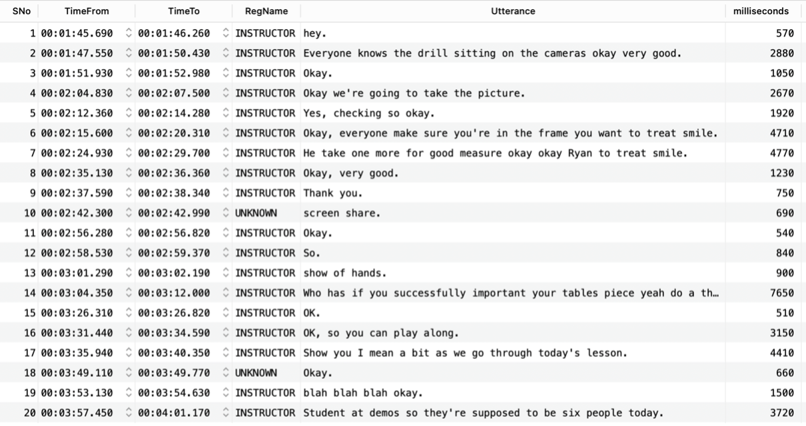

# Data Wrangling and Engagement Insights

**Author**: Sally Marcellina Yeo  

## Overview

This repository contains my submission for the End-of-Course Assignment (ECA) for the ANL503 Data Wrangling course. The project focuses on generating insights from auto-generated Zoom class transcripts. The tasks include data extraction, data transformation, and visualization to analyze student engagement based on participation captured through dialogue in a `.vtt` file.

## Key Components

### 1. Data Extraction and Transformation
- **Python Script**: A Python program is used to read a `.vtt` (Web Video Text Tracks) file, parse it, and extract dialogue components (SNo, TimeFrom, TimeTo, RegName, and Utterance).
- **MySQL Database**: The extracted data is stored in a MySQL table called `vtt`. A new table `vttclean` is created with an additional column that calculates the dialogue duration in milliseconds.

### 2. Visualization
- **R Script**: An R script generates a barchart showing the total airtime (in milliseconds) for each student who participated in the Zoom session.

## Project Structure

- **`503eca_1a.py`**: Python script for extracting dialogue components from the `.vtt` file and storing the data in a MySQL table.
- **`503eca_1b.sql`**: SQL script that creates a new table with dialogue duration in milliseconds and performs data transformations.
- **`503eca_1c.R`**: R script that reads data from MySQL, filters it, and generates a barchart showing student participation airtime.

# Preview of the given captured_dialogue.vtt file

```plaintext
WEBVTT

1
00:01:45.690 --> 00:01:46.260
INSTRUCTOR: hey.

2
00:01:47.550 --> 00:01:50.430
INSTRUCTOR: Everyone knows the drill sitting on the cameras okay very good.

3
00:01:51.930 --> 00:01:52.980
INSTRUCTOR: Okay.

4
00:02:04.830 --> 00:02:07.500
INSTRUCTOR: Okay we're going to take the picture.

5
00:02:12.360 --> 00:02:14.280
INSTRUCTOR: Yes, checking so okay.

6
00:02:15.600 --> 00:02:20.310
INSTRUCTOR: Okay, everyone make sure you're in the frame you want to treat smile.

7
00:02:24.930 --> 00:02:29.700
INSTRUCTOR: He take one more for good measure okay okay Ryan to treat smile.

8
00:02:35.130 --> 00:02:36.360
INSTRUCTOR: Okay, very good.

9
00:02:37.590 --> 00:02:38.340
INSTRUCTOR: Thank you.

10
00:02:42.300 --> 00:02:42.990
screen share.
```

# Python Script Explanation

Import necessary library:

```python
import os   # to set working directory
import re   # for regex
import pandas as pd
import pymysql
from sqlalchemy import create_engine
from sqlalchemy.engine.url import URL
```
Defining Regex:

```python
# Define regex for parsing
INIT_regex = re.compile(r'^WEBVTT\s*$')
SNo_regex = re.compile(r'^(\d+)\s*$')
Time_regex = re.compile(r'^(\d{2}:\d{2}:\d{2}\.\d{3}) --> (\d{2}:\d{2}:\d{2}\.\d{3})\s*$')
NameUtt_regex = re.compile(r'^([^:]+):\s?(.*)$')
```

Read the VTT file:

```python
# Set your working directory
os.chdir('/Users/sallyyeo/Desktop/ANL503ECA')

# Read the VTT file, with handle file closure
vttpath = 'captured_dialogue.vtt'
with open(vttpath) as vtt:
    all_lines = vtt.readlines()
```

Initialize the necessary list and variable:

```python
# Initialize lists to store extracted values
sno_list, time_from_list, time_to_list, reg_name_list, utterance_list = [], [], [], [], []

# Initialize an unknown speaker
unknown_speaker = None
```

Set up the for-loop:

```python
lookingFor = 'INIT'
for i, current_line in enumerate(all_lines):
    if lookingFor == 'INIT':
        mo = INIT_regex.search(current_line)
        if mo:
            lookingFor = 'SNo'
            continue
    elif lookingFor == 'SNo':
        mo = SNo_regex.search(current_line)
        if mo:
            sno = int(mo.group(1))  # Retrieve only the seq number
            lookingFor = 'TimeFrom'
            continue
    elif lookingFor == 'TimeFrom':
        mo = Time_regex.search(current_line)
        if mo:
            time_from, time_to = mo.groups()
            lookingFor = 'RegName'
            continue
    elif lookingFor == 'RegName':
        mo = NameUtt_regex.search(current_line)
        if mo:
            reg_name, utterance = mo.groups()
        else:
            # If the current line does not match NameUtt_regex,
            # check if it's because it's a continuation of the last utterance or 
            # has no named speaker.
            if current_line.strip() == "":
                # Skip empty lines
                continue
            elif not unknown_speaker:
                # If there's no speaker, assign UNKNOWN
                reg_name = "UNKNOWN"
                utterance = current_line.strip()

        # Append values to lists
        sno_list.append(sno)
        time_from_list.append(time_from)
        time_to_list.append(time_to)
        reg_name_list.append(reg_name)
        utterance_list.append(utterance)

        # At the end of dialogue block, next thing look for SNo
        lookingFor = 'SNo'
```

Passing in the list into data frame:

```python
# Create DataFrame from lists
df = pd.DataFrame({
    'SNo': sno_list,
    'TimeFrom': time_from_list,
    'TimeTo': time_to_list,
    'RegName': reg_name_list,
    'Utterance': utterance_list
})

# Print for debugging
print(df)
```

To connect to SQL database and create the table:

```python
# SQLAlchemy engine URL for MySQL
# to handle special characters in password
engine_url = URL.create(
    "mysql+pymysql",
    username="root",
    password="yourpassword", 
    host="localhost",
    database="yourdatabasename"
)

engine = create_engine(engine_url)

# Create table in MySQL
df.to_sql('vtt', con=engine, if_exists='replace', index=False)
```

```sql
-- Check data type of vtt table DESCRIBE vtt;
-- Convert TimeFrom and TimeTo to TIME type
ALTER TABLE vtt MODIFY TimeFrom TIME(3);

ALTER TABLE vtt MODIFY TimeTo TIME(3);

-- Use TIMESTAMPDIFF to calculate the difference between two datetime
-- Specify the unit as microsecond, the two datetime: TimeFrom and TimeTo
CREATE TABLE vttclean AS
SELECT
	*,
	TIMESTAMPDIFF(
		MICROSECOND, TimeFrom, TimeTo)
	DIV 1000 AS milliseconds
FROM
	vtt;

-- To see result
SELECT
	*
FROM
	vttclean;
```
Output:




